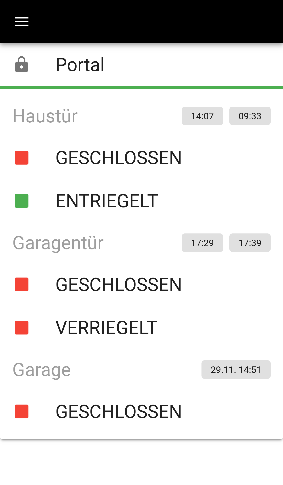
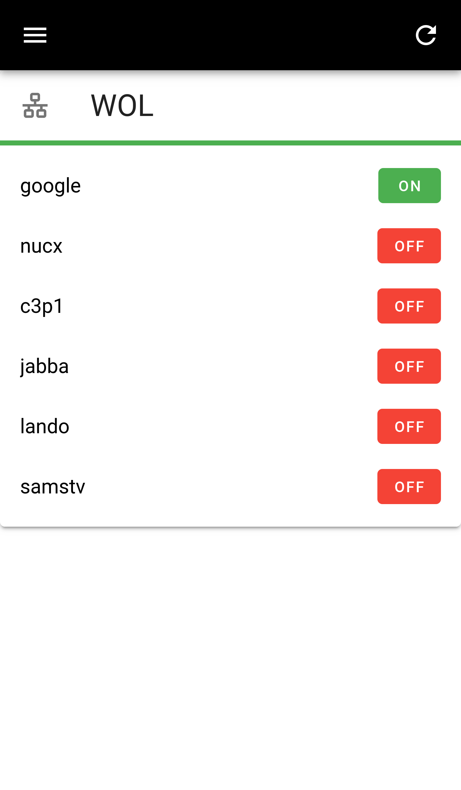

# node-muhx

**m**uh **u**nified **h**omeautomation **x**tended

A Homeautomation Frontend & Backend built with Vue.js

<p align="center">


</p>


## Contents

 * [Features](#features)
 * [Installation](#installation)
 * [Configuration](#configuration)
 * [Hardware](#hardware)
 * [Troubleshooting](#troubleshooting)
 * [Todo](#todo)

## Features

 * Display garage & doors 
 * Control garage & doors
 * List server & WOL
 
### Software

 * nodejs
 * socket.io
 * vuetify
 * mqtt
 * influxdb2

## Installation

### Prerequisites

Install docker & mqtt

### Installation

Clone git node-muhx repository, install node-muhx dependencies
 
```bash
git clone https://github.com/13/node-muh.git

docker run
```
